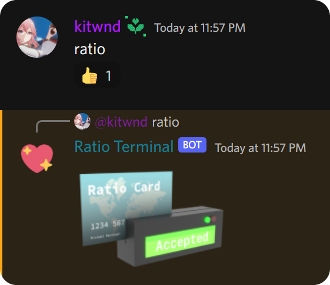

  

<h1 align="center">Ratio Terminal</h1>

Remember Twitter ratios? Well, here these are for Discord.

<a href="https://hub.docker.com/r/kitwnd/ratio_terminal">
Docker Hub
</a>

### Setup

#### Docker (recommended)

- Clone/download this repo
- Rename `data/.env.example` to `data/.env` and add your bot token to that file.
- `docker-compose up -d`

#### Manual

- Python 3.10 recommended
- Clone/download this repo
- `pip install -r requirements.txt`
- Rename `data/.env.example` to `data/.env` and add your bot token to that file.
- `python3 src/main.py`

### License

MIT
